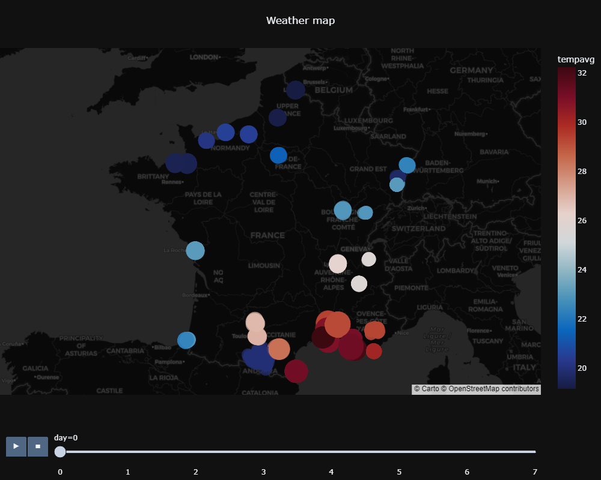
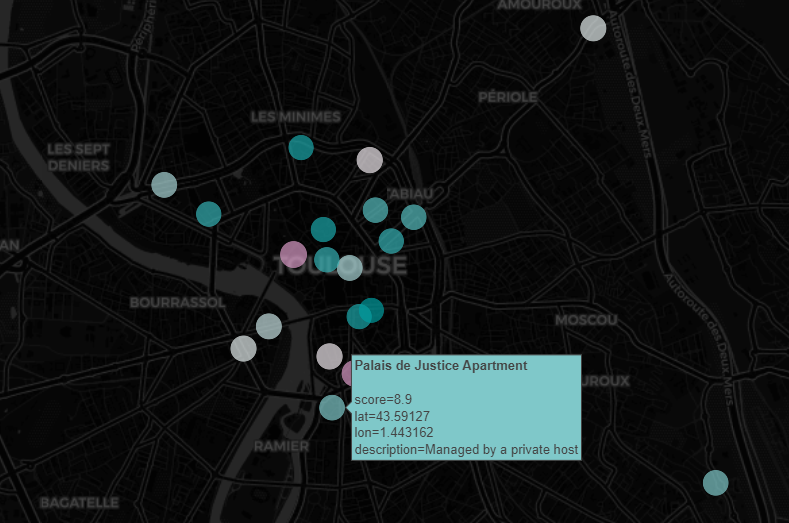

The marketing team needs help on a new project. After doing some user research, the team discovered that 70% of their users who are planning a trip would like to have more information about the destination they are going to.

In addition, user research shows that people tend to be defiant about the information they are reading if they don’t know the brand which produced the content.

Therefore, Kayak Marketing Team would like to create an application that will recommend where people should plan their next holidays. The application should be based on real data about:

- Weather
- Hotels in the area The application should then be able to recommend the best destinations and hotels based on the above variables at any given time.

Goals of this project:

- Scrape data from destinations Get weather data from each destination
- Get hotels’ info about each destination
- Store all the information above in a data lake
- Extract, transform and load cleaned data from your datalake to a data warehouse
- Create animated framed graphics

> Video link to understand the code (FR) : https://share.vidyard.com/watch/KJ2Z7BJLtUjjRDi28k9kZc?

> First animated map of average temperature

> Second map with the best 20 hotels in Toulouse 

